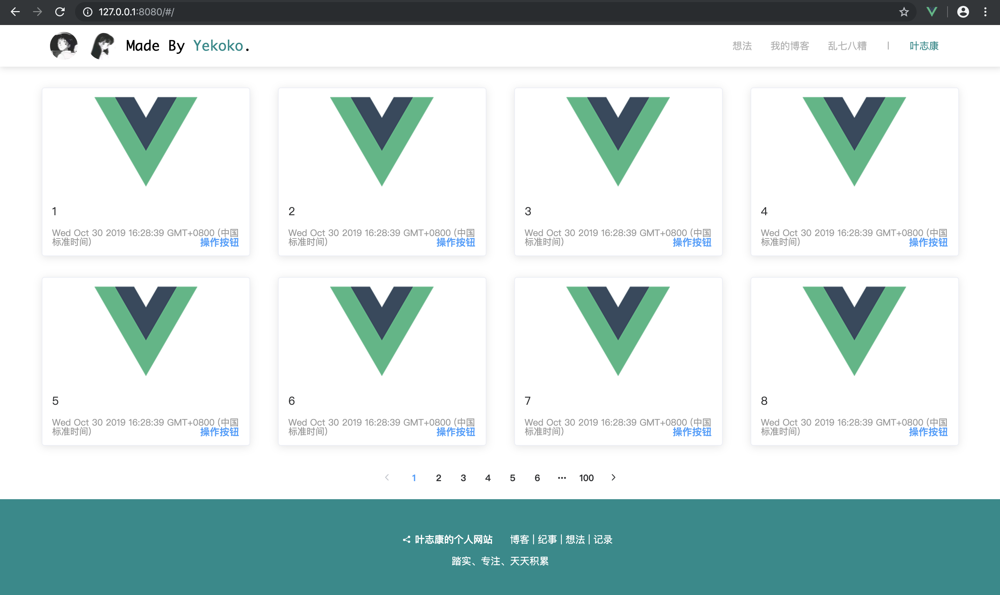

# 实验7的一些解释

> A Vue.js (frontend) & express (backend) project 

## Build Setup

``` bash
# install dependencies
npm install

# build for production with minification
npm run build

# express 包导入
npm install express --save
# nodemon 包导入
npm install nodemon --save
# element-UI 包导入
npm install element-ui --save
# axios 插件导入
npm install axios --save

# serve with hot reload at localhost:8080
npm run dev

# backend reload at localhost:3000
cd server
nodemon app.js
```

## 前后端传递参数
### 一个简单的例子：
前端：
```
# content.vue         // running at localhost:8080
<script>
  export default {
    name:'content-body'
    methods:{
      aMethod(){
        this.$axios.get('/getinfo/').then( res => {
            console.log(res)    // return a obj(data)
        }).catch( error => {
            console.log(error)  // catch error
        })
      }
    }
  }
</script
```

后端：
```
# app.js           //running at localhost:3000
...
app.get('/getinfo',function(req,res){
  res.send({
    code : 200,
    msg : "Succeed,Hello,YeZhikang!"
  })
})
...
```

## 项目演示
> head 和 footer 原型是我自己当时博客项目做的组件





